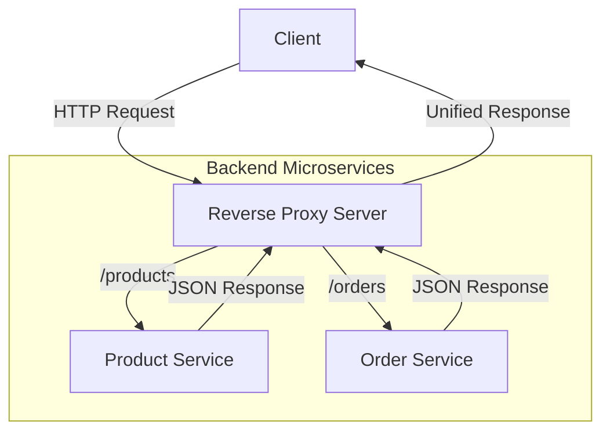

# 🚀 Reverse Proxy Architecture

<div align="center">

<h3>✨ Centralized Microservice Routing ✨</h3>

<p>
A lightweight and scalable reverse proxy system that efficiently routes client requests to distributed backend microservices through a single gateway.
</p>

<p><strong>Built with Node.js and JavaScript</strong></p>

</div>

---

## 🌟 Overview

This project demonstrates a **centralized reverse proxy architecture** designed for microservice-based systems.
The reverse proxy acts as a **single entry point**, forwarding incoming HTTP requests to the appropriate backend service based on URL routing rules.

It is ideal for understanding:

* Microservice communication
* API gateway concepts
* Request routing and abstraction
* Scalable backend design

---

## ✨ Key Features

<table>
<tr>
<td align="center">
<h4>🛣️ Intelligent Routing</h4>
Routes requests dynamically based on URL paths such as <code>/products</code> and <code>/orders</code>.
</td>
<td align="center">
<h4>🧱 Microservices Ready</h4>
Independent Product and Order services with clear separation of concerns.
</td>
</tr>
<tr>
<td align="center">
<h4>🛡️ Central Gateway</h4>
Single entry point improves security, logging, and request management.
</td>
<td align="center">
<h4>📈 Scalable Architecture</h4>
Each microservice can be scaled or deployed independently.
</td>
</tr>
</table>

---

## 🛠️ Tech Stack

<div align="center">

### ⚙️ Core Technologies

<p>


</p>

<p>


</p>

</div>

---

## 🎯 System Architecture



---

## 🚀 Quick Start Guide

| Step | Action                | Description                                                      |
| ---: | --------------------- | ---------------------------------------------------------------- |
|  1️⃣ | Clone Repository      | `git clone https://github.com/Aakashkethavath/Reverse_proxy.git` |
|  2️⃣ | Install Dependencies  | `npm install`                                                    |
|  3️⃣ | Start Product Service | `node product.js`                                                |
|  4️⃣ | Start Order Service   | `node order.js`                                                  |
|  5️⃣ | Start Proxy Server    | `node server.js`                                                 |

The reverse proxy will now route requests to the correct backend service automatically.

---

## 🔗 API Endpoints

| Service         | Endpoint    | Method | Description                 |
| --------------- | ----------- | ------ | --------------------------- |
| Product Service | `/products` | GET    | Returns list of products    |
| Order Service   | `/orders`   | GET    | Returns order history       |
| Reverse Proxy   | `/`         | ALL    | Routes requests to services |

---

## 📁 Project Structure

```text
Reverse_proxy/
├── server.js        # Reverse Proxy Gateway
├── product.js       # Product Microservice
├── order.js         # Order Microservice
├── package.json     # Project Dependencies
└── .gitignore       # Git Ignore Rules
```

---

## 🤝 Contributing

<div align="center">
<h3>🌟 Contributions Are Welcome 🌟</h3>
<p>Help improve routing logic, add middleware, or extend services.</p>
</div>

### Contribution Steps

| Step | Action          | Command                                |
| ---: | --------------- | -------------------------------------- |
|  1️⃣ | Fork Repository | GitHub Fork                            |
|  2️⃣ | Clone Fork      | `git clone <your-fork-url>`            |
|  3️⃣ | Create Branch   | `git checkout -b feature/your-feature` |
|  4️⃣ | Make Changes    | Implement improvements                 |
|  5️⃣ | Commit          | `git commit -m "Add feature"`          |
|  6️⃣ | Push            | `git push origin feature/your-feature` |
|  7️⃣ | Pull Request    | Open PR                                |

---

## 👨‍💻 Author

<div align="center">

<h3>Built by</h3>

<a href="https://github.com/Aakashkethavath">

</a>

</div>

---

<div align="center">

<h3>⭐ If this project helped you, consider giving it a star ⭐</h3>

<p>


</p>

</div>


